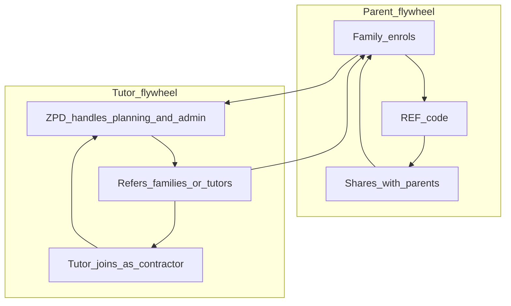

# Tutor Network Virality — Supply-Side Growth

Casual teachers are a **second growth engine**, parallel to parent referrals. Same decentralised model — different incentive, different message.

## Two flywheels

|                     | Parent referral                                                                                         | Tutor network                                             |
| ------------------- | ------------------------------------------------------------------------------------------------------- | --------------------------------------------------------- |
| **Who**             | Enrolled families                                                                                       | Classroom-active casuals / teachers                       |
| **Incentive**       | $100 off for a friend                                                                                   | Contractor income + referral upside; ops handled for them |
| **What they share** | "This tutoring worked for us"                                                                           | "I tutor through ZPD — families I trust"                  |
| **Proof type**      | Emotional / child outcomes                                                                              | Professional credibility + curriculum fit                 |
| **Product today**   | Referral codes after purchase ([`ReferralShareCard`](../../app/enrol/components/ReferralShareCard.tsx)) | **Manual** — no tutor portal or tutor referral codes yet  |

---

## Value proposition for casual teachers

**Lead with what you remove from their plate — not "extra work."**

### You handle

- Parent intake and insights funnel
- Session planning and learning sequences (AI-assisted, tutor-owned delivery)
- Enrolment, payments, term structure
- Contractor payments (ABN, invoicing rhythm — define clearly)
- Matching families to the right tutor in their area / online

### They keep

- The teaching — relationship with the child
- Professional judgement in the ZPD
- Flexibility of casual life without building a solo tutoring business
- **Financial upside** when they refer families or other strong tutors

### One-line for tutors

> _Teach in the zone. We run the plan, the parents, and the business._

---

## Why tutors virally share (unlike generic gig work)

1. **Staff-room trust** — other casuals ask "how do you get tutoring clients?"
2. **Parent overlap** — teachers already meet parents who need support; referral feels like help, not sales
3. **Reputation stake** — they only refer families they'd actually teach well
4. **Repeat income** — term plans = stable contractor hours vs one-off Gumtree gigs
5. **No admin guilt** — they're not handing parents a dodgy Facebook ad; they're handing them a structured system

---

## Incentive structure (define before scaling)

Document your actual numbers here once decided:

| Action                                                      | Suggested model                                | Notes                                                                                      |
| ----------------------------------------------------------- | ---------------------------------------------- | ------------------------------------------------------------------------------------------ |
| Tutor delivers sessions                                     | Contractor rate per session / term             | Core income — see internal `rate-card.md` ($55–68/session by plan); **not on public site** |
| Tutor refers **family** who enrols                          | $**_ per Diagnostic OR $_** per term plan      | Paid after payment clears; track in spreadsheet → Phase 2 admin                            |
| Tutor refers **another tutor** who joins + completes 1 term | $\_\_\_ one-off bounty                         | Quality gate: referred tutor must pass vetting + complete term                             |
| Parent uses tutor's code at enrol                           | Mirror parent $100 off OR tutor-specific promo | Requires **tutor referral codes** in product (Phase 2)                                     |

**Principle:** Tutor referral fee should feel meaningful on one term (~$50–$150 AUD range is common in ed-referral) without eroding margin on Essential ($950).

---

## Messaging — tutor-facing (not parent-facing)

**Do say:**

- Planned sequences, not homework hell
- You stay classroom-active; we don't ask you to pretend to be a full-time agency
- Decentralised — online or in-home near schools you already work in
- WWCC and vetting already part of the system

**Don't say:**

- "Passive income" (insulting to teachers)
- "Easy money"
- Anything that sounds like they're selling out parents

---

## How tutors spread (channels)

| Channel                                    | Tactic                                                                     |
| ------------------------------------------ | -------------------------------------------------------------------------- |
| Staff rooms / casual networks              | Word of mouth — one satisfied tutor is worth 10 posts                      |
| Existing ZPD tutor refers colleague        | Highest quality supply                                                     |
| Teacher Facebook groups (AU)               | Value post: "how I tutor without building a business" — not a hiring blast |
| University ed grad / casual teacher groups | Same angle — ops handled                                                   |
| Parent pickup line / school events         | Soft: "if you ever need…" — tutor gives card or link, not hard sell        |

**Same rule as parent Facebook:** value first, link second, enrol never in the first breath.

---

## Onboarding sequence (manual until Phase 2)

1. **Identify** 2–3 casuals you trust (pilot cohort)
2. **Coffee / 15-min call** — walk through planning funnel + contractor terms
3. **Give tutor kit:** `tutor-one-pager.md` + personal enrol link (today: generic `/enrol` + track source in spreadsheet)
4. **First family** matched — tutor experiences full planning pipeline
5. **Ask for one referral** — family or colleague — only after successful term start
6. **Pay referral bounty** on time — trust is the whole game

---

## Tutor kit (what to send)

See [`tutor-one-pager.md`](./tutor-one-pager.md) — email or PDF for casuals.

Optional physical: simple card with QR → `zpdlearning.com/enrol?plan=trial` and tutor name in `?ref=` once tutor codes exist.

---

## Product gaps (Phase 2)

To scale tutor virality beyond spreadsheets:

- [ ] Tutor-specific referral / tracking codes (`TUTOR-NAME` or `REF` tied to `owner_email` of tutor)
- [ ] Tutor portal: view matched families, session plans, mark sessions complete
- [ ] Automated contractor payment reporting
- [ ] Admin view: tutor-attributed enrollments and referral bounties owed
- [x] `/tutors` dual-audience page (parent trust + `#join` recruitment band; no public $ rates)

**Agent command:** "Build tutor referral tracking from marketing/tutor-network/"

---

## Metrics (add to weekly tracker)

| Metric                                   | Target (pilot)                      |
| ---------------------------------------- | ----------------------------------- |
| Active contractor tutors                 | 3 → 10                              |
| Families from tutor referral             | Track manually: source = tutor name |
| Tutor → tutor referrals                  | 1 per active tutor per term         |
| Tutor NPS / would you refer a colleague? | Ask monthly                         |

---

## Where this sits in the marketing plan

- **Phase 1:** Pilot with 2–3 tutors manually; no product build
- **Phase 1b (parallel Week 2–3):** Tutor one-pager + staff-room word of mouth
- **Phase 2:** Tutor codes + `/tutors` page + admin bounty tracking

Parent marketing and tutor marketing **run in parallel** — parents fill demand, tutors fill supply and both can refer.
